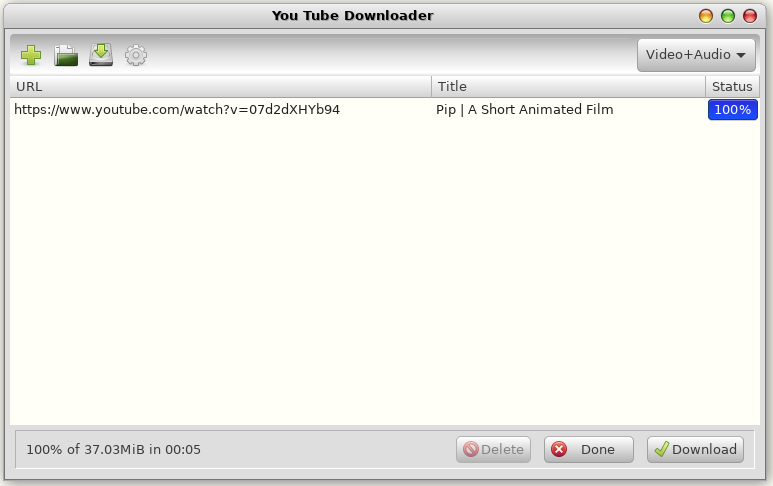
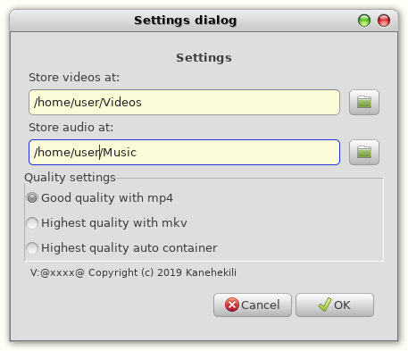

# YoutubeDownloader
GTK3 UI for youtube-dl,vimeo and others

Version 1.2.1

This simple GUI for the youtube-dl runs on linux. 



### Features
Downloads either video(with audio) or audio only from youtube, vimeo and other platforms by simply dragging the url from the browser to the list. 

In addition an URL may be entered manually using the "plus" icon

The URLs in the list can be saved and restored

When downloading, the "Download" button becomes an "Interrupt" button, which enables you to stop the download while underway.

### Settings
Clicking the "clogwheel" icon you may set the target directories for video and audio individually as well as the download quality.



There are 3 options for video quality:
* A MP4 container will lead mostly to a good result,but usually not the best
* MKV container can take literally any codec. Since youtube often uses webm container with vp9 and opus codecs this would be the choice for best quality
* The "auto" modus will not pass any merge requests to youtube-dl, so depending on the available data either MKV or webm container will be the output. 

### Prerequisites
  * python3
  * python3-gi (debian) or python-gobject (Arch)
  * youtube-dl
  * ffmpeg

### Prepare install on Debian, Linux Mint (19.X) or Ubuntu 18.04 (bionic) 
```
sudo apt install python3-gi ffmpeg
```
Unfortunately Ubuntu and derivates offer a very old version of youtube-dl which does not work. Use included bashfile for installing the latest youtube-dl direct from their homepage:

```
sudo ./installYoutube-dl.sh
```
Currently Debian Stable has a working version, which can be downloaded with apt
### Prepare install on Arch or Manjaro
```
sudo pacman -Syu python-gobject ffmpeg youtube-dl
```

### How to install
* Download the YtDownloader*.tar contained in the "build" folder 
* Unpack it and run the command  **sudo ./install.sh** in the unpacked folder.
* Install just copies a desktop file and some python scripts to /usr/local/sbin/YtDownloader
* In case your distros youtube-dl is too old use **sudo ./installYoutube-dl.sh** to get the lastest version. Be sure to remove the youtube-dl package before, in case it is already installed

### Changes
 * 2019-11 Immediate download when dragged, added context menus for delete, delete via "DEL" button, clean output file name   

