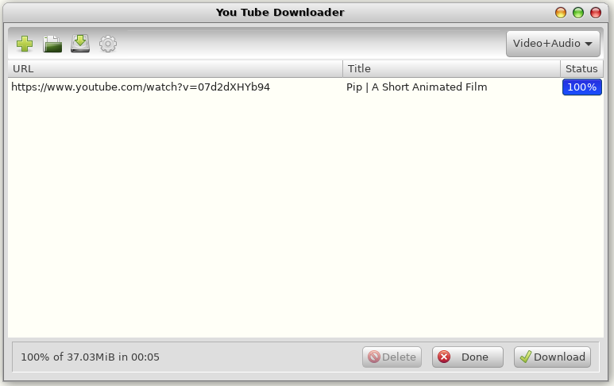
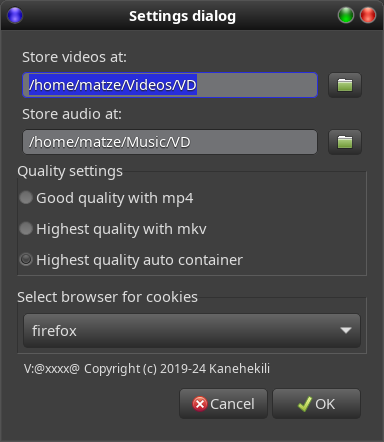

# YoutubeDownloader
GTK3 UI for youtube,vimeo and others

Version 1.6.1


This simple GUI for the youtube-dl runs on linux. Goal was to get **high quality** audio and video using ffmepg where necessary.



### Features
* Downloads either video(with audio) or audio only from youtube, vimeo and other platforms by simply dragging the url from the browser to the list. 

* Videos from different sites (such as Youtube, Vimeo,Rumble and (German Broadcasting)Mediatheks can be downloaded.

* Press the "Download" button to download the list or single URLs.

* In addition an URL may be entered manually using the "plus" icon

* The URLs in the list can be saved and restored

* When downloading, the "Download" button becomes an "Interrupt" button, which enables you to stop the download while underway.

* Doubleclick on an downloaded entry will start playing it with the default audio/video player

* Via context menu entries can be removed, folders opened or files downloaded again(forced)

* Multi selection via "CRTL+A" 

* Can also be started via terminal with "ytgui"

* Switch between single and palylist download

* Update the "yt-dl" backend by using the "circle" icon. This will check if a newer version is available - regardless if your DE provides its own binary.

### Settings
Clicking the "clogwheel" icon you may set the target directories for video and audio individually as well as the download quality.



There are 3 options for video quality:
* A MP4 container will lead mostly to a good result,but usually not the best
* MKV container can take literally any codec. Since youtube often uses webm container with vp9 and opus codecs this would be the choice for best quality
* The "auto" modus will not pass any merge requests to youtube-dl, so depending on the available data either MKV or webm container will be the output. 

Select the browser for downloading - Youtube enforces this.
* Youtube will hinder you - select the browser which you are using while dragging. Be sure that you are "logged in to youtube" - otherwise you will not be able to download.

### Change backend
If yt-dl is provided by your distro, you may not need to update it. However a local yt-dl version is provided -which can be activated by the "switcher" button next to the "Updater". The switcher button is not shown if no yt-dl has been provided by the distro - the internally provided python blob is used.


### Prerequisites
  * python3
  * python3-gi (debian) or python-gobject (Arch)
  * ffmpeg
  * js Framework, like nodejs, deno or quickjs


### Install on Arch or Manjaro
Search for "ytdownloader" in pamac, yay or on AUR. If done by hand:
* Download PKGBUILD from https://aur.archlinux.org/packages/ytdownloader/
* Open terminal and execute "makepkg -s"
* sudo pacman -U ytdownloader.... 

### Install on Ubuntu 24.04 (Noble) or newer and Linux Mint equivalents
* (sudo apt-key adv --keyserver keyserver.ubuntu.com --recv-keys 10FA0B428C349916)
* sudo add-apt-repository ppa:jentiger-moratai/mediatools
* sudo apt update
* sudo apt install ytdownloader

### Manual install
The ./install.sh file should install ffmpeg, if not available (thanks to @fischer-felix). The python gtk libs should be already installed.

Below an exact description of dependent packages. 

### Prepare manual install on Debian
```
sudo apt install python3-gi ffmpeg
```
### Prepare manual install on Arch or Manjaro
```
sudo pacman -Syu python-gobject ffmpeg
```

### Prepare manual install on Fedora
Fedora does not ship `ffmpeg` in its default repositories due to patent restrictions. The first command adds RPM Fusion, a third-party repository that provides it.
```
sudo dnf install https://mirrors.rpmfusion.org/free/fedora/rpmfusion-free-release-$(rpm -E %fedora).noarch.rpm https://mirrors.rpmfusion.org/nonfree/fedora/rpmfusion-nonfree-release-$(rpm -E %fedora).noarch.rpm
sudo dnf install ffmpeg
```

### How to install(Manual)
* Download the current YtDownloader*.tar 
* Unpack it and run the command  **sudo ./install.sh** in the unpacked folder.
* Install just copies a desktop file and some python scripts to /opt/ytdownloader
* ffmpeg will be installed if the packagemanager is recognized (thanks to @fischer-felix) , the additional python lib should be already installed

### Changes
 * 2026-06 Fixed YouTube downloads with updated player client arguments (web_embedded, web, tv)
 * 2026-06 Improved download status messages: "Merging video and audio", "Extracting audio", "Done"
 * 2026-06 Fixed misleading yt-dlp warning URL appearing in status bar
 * 2026-06 Fixed GTK deprecation warning for context menu items
 * 2025-12 Added JS as dependency, select if single file or playlist should be downloaded
 * 2025-08 Adapt playlists - replace broken GTK3 spinner
 * 2025-07 Use cookies for Youtube
 * 2024-09 fix youtube change for playlists 
 * 2024-04 yt-dlp delivered for arch, make it selectable
 * 2023-10 yt-dlp not delivered for arch, but is dependency
 * 2022-12 command is now ytgui 
 * 2022-10 Updated regex for new progress in yt-dlp  
 * 2022-05 Created deb version for jammy(Ubuntu 22.04) 
 * 2022-02 Update install.sh(thanks to @fischer-felix) + Deb improvements 
 * 2021-11 Prepare for debian .deb 
 * ...


 


 