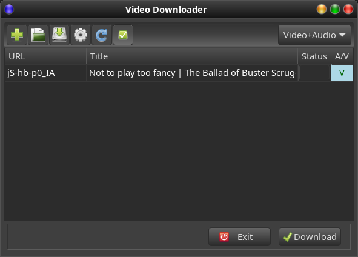

# YoutubeDownloader
GTK3 UI for youtube,vimeo and others

Version 1.4.4


This simple GUI for the youtube-dl runs on linux. Goal was to get **high quality** audio and video using ffmepg where necessary.



### Features
* Downloads either video(with audio) or audio only from youtube, vimeo and other platforms by simply dragging the url from the browser to the list. 

* Videos from different sites (such as Youtube, Vimeo,Rumble and (German Broadcasting)Mediatheks can be downloaded.

* Press the "Download" button to download the list or single URLs.

* In addition an URL may be entered manually using the "plus" icon

* The URLs in the list can be saved and restored

* When downloading, the "Download" button becomes an "Interrupt" button, which enables you to stop the download while underway.

* Doubleclick on an downloaded entry will start playing it with the default audio/video player

* Via context menu entries can be removed, folders opened or files downloaded again(forced)

* Multi selection via "CRTL+A" 

* Can also be started via terminal with "ytgui"

### Settings
Clicking the "clogwheel" icon you may set the target directories for video and audio individually as well as the download quality.


There are 3 options for video quality:
* A MP4 container will lead mostly to a good result,but usually not the best
* MKV container can take literally any codec. Since youtube often uses webm container with vp9 and opus codecs this would be the choice for best quality
* The "auto" modus will not pass any merge requests to youtube-dl, so depending on the available data either MKV or webm container will be the output. 

### Prerequisites
  * python3
  * python3-gi (debian) or python-gobject (Arch)
  * ffmpeg


### Install on Arch or Manjaro
Search for "ytdownloader" in pamac, yay or on AUR. If done by hand:
* Download PKGBUILD from https://aur.archlinux.org/packages/ytdownloader/
* Open terminal and execute "makepkg -s"
* sudo pacman -U ytdownloader.... 

### Install on Ubuntu 20.04 or Mint 20.X
* (sudo apt-key adv --keyserver keyserver.ubuntu.com --recv-keys 10FA0B428C349916)
* sudo add-apt-repository ppa:jentiger-moratai/mediatools
* sudo apt update
* sudo apt install ytdownloader

### Manual install
The ./install.sh file should install ffmpeg, if not available (thanks to @fischer-felix). The python gtk libs should be already installed.

Below an exact description of dependent packages. 

### Prepare manual install on Debian (can't unpack the "modern" deb compression...)
```
sudo apt install python3-gi ffmpeg
```
### Prepare manual install on Arch or Manjaro
```
sudo pacman -Syu python-gobject ffmpeg
```

### Prepare manual install on Fedora
```
sudo dnf -y install https://download1.rpmfusion.org/free/fedora/rpmfusion-free-release-$(rpm -E %fedora).noarch.rpm
sudo dnf -y install https://download1.rpmfusion.org/nonfree/fedora/rpmfusion-nonfree-release-$(rpm -E %fedora).noarch.rpm
sudo dnf -y install ffmpeg
```

### How to install(Manual)
* Download the current YtDownloader*.tar 
* Unpack it and run the command  **sudo ./install.sh** in the unpacked folder.
* Install just copies a desktop file and some python scripts to /opt/ytdownloader
* ffmpeg will be installed if the packagemanager is recognized (thanks to @fischer-felix) , the additional python lib should be already installed

### Changes
 * 2019-11 Immediate download when dragged, added context menus for delete, delete via "DEL" button, clean output file name   
 * 2019-12 Doubleclick invokes play of default audio or video player, open folder via context menu  
 * 2021-02 Support for youtube playlists - redesigned the model, multiple selection possible
 * 2021-02 Added update for youtube-dl (if installed manually by the "installYoutube-dl" script)
 * 2021-02 Fixed youtube playlist special url downloads
 * 2021-03 Support for various media platforms
 * 2021-11 Prepare for AUR PKGBUILD
 * 2021-11 Moved backend from youtube-dl to yt-dlp
 * 2021-11 Prepare for debian .deb 
 * 2022-02 Update install.sh(thanks to @fischer-felix) + Deb improvements
 * 2022-05 Created deb version for jammy(Ubuntu 22.04)
 * 2022-10 Updated regex for new progress in yt-dlp
 * 2022-12 command is now ytgui 
 